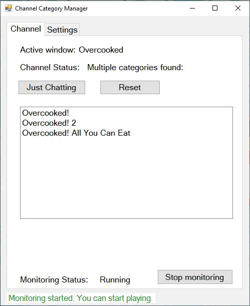
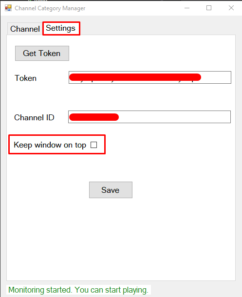
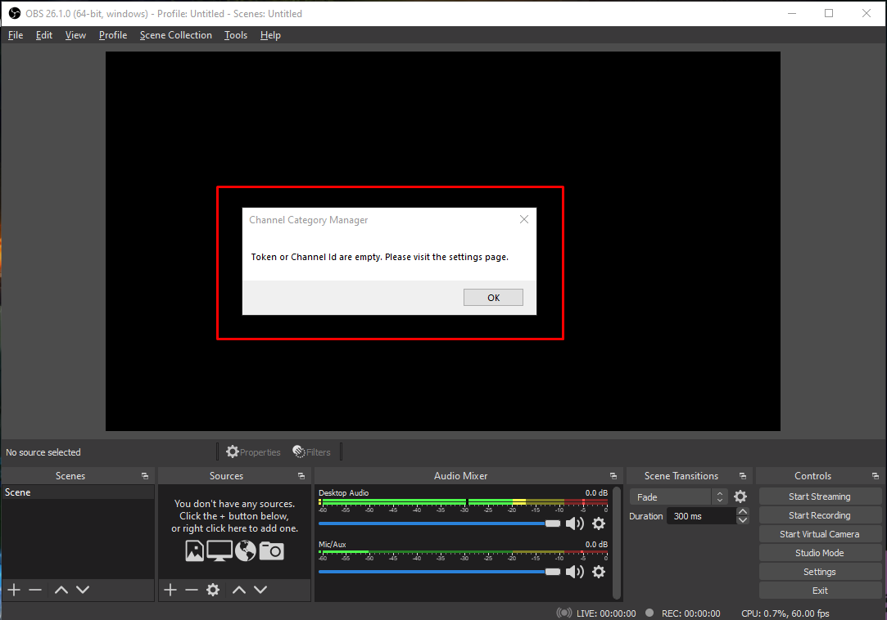
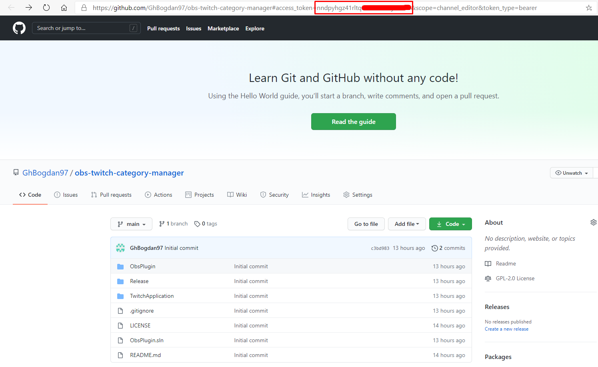
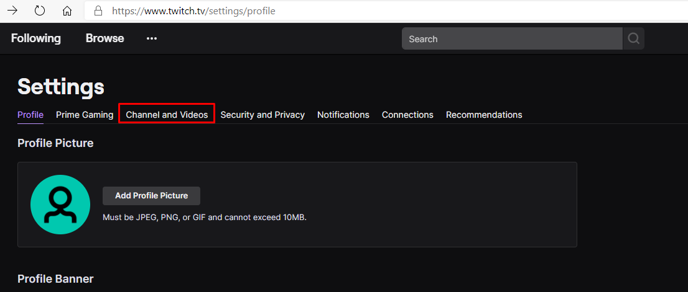
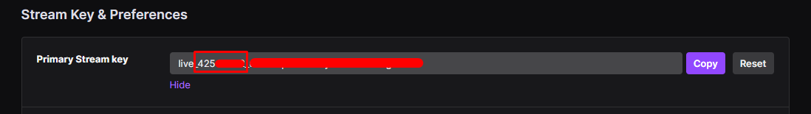

# obs-twitch-category-manager

# About

This plugin finds a corresponding category on Twitch for the game you're playing, by monitoring the active window on your computer. The following situations appear:
1. A single category is found  
     In this case the channel will be updated automatically
2. Multiple categories are found for your current game  
     In this case they are displayed in a list and you can choose the one you want.
3. No categories found  
     In this case nothing happens, the plugin will check again after 5 seconds.

While the game you've first chosen is open, the plugin will ignore any new games you open. To change this, you can click on "Reset". The plugin refreshes and checks the active window every 5 seconds.

There's also a "Just Chatting" shortcut to update your category to "Just Chatting" and stop monitoring the active window.  

From the "Settings" tab you can choose to pin the plugin window on top of all the other windows, for easier access:  

# Permissions and Privacy considerations

Required permissions: This plugin requires rights to edit your channel to update the game category.

Because no external server is involved and all communications are just between your computer and Twitch, no data about your activity or processes is saved or transfered to a third party.

# Usage

1. Donwload the TwitchAppRelease.zip from the "Release folder": https://github.com/GhBogdan97/obs-twitch-category-manager/tree/main/Release
2. Extract the contents of the zip file in a new folder.
3. Navigate to that folder and copy its contents.
4. Navigate to OBS install folder.
5. Open the "obs-plugins" folder.
6. Open the "x64" folder.
7. Paste the copied files.

# Setup

First time openning the OBS a pop-up will inform you to navigate to the settings tab of the plugin. (Please note that the OBS window might cover it. If you can't find it, try moving the OBS window first.)   

Navigate to the "Settings" tab of the plugin. To setup the plugin you have to fill in the following information:

1. Access token - Used while interacting with Twitch 
To get an access token, simply click on the "Get Token" button. It will redirect you to the GitHub page of this plugin. The token will be present in the URL, as shown below:   

2. Channel Id - Used to identify the channel while interacting with Twitch 
To get the channel id, navigate to Twitch -> Settings -> Channel and Videos   

Click on "Show" under the "Primary Stream key" and copy the first set of numbers:   

Save the settings by clicking on the "Save" button.  

As a final step,  from the "Channel" tab, click on "Start monitoring" to start the functionality. (Please note that the monitoring will start automatically in the future.)

